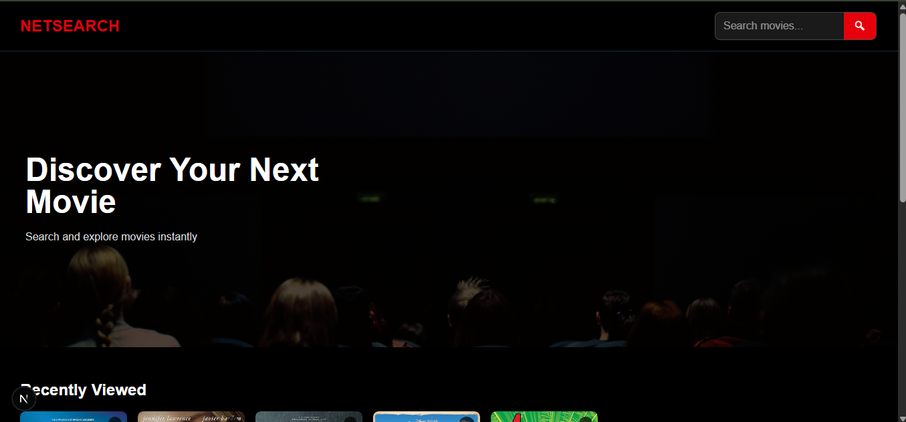
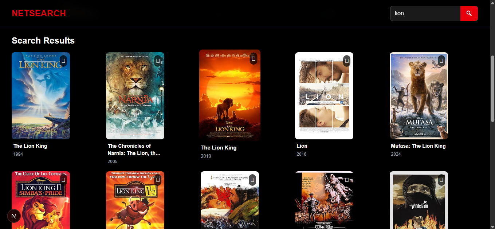
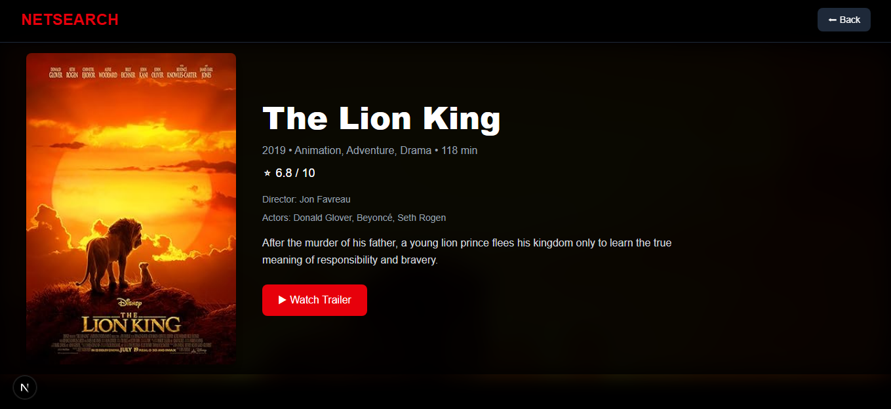
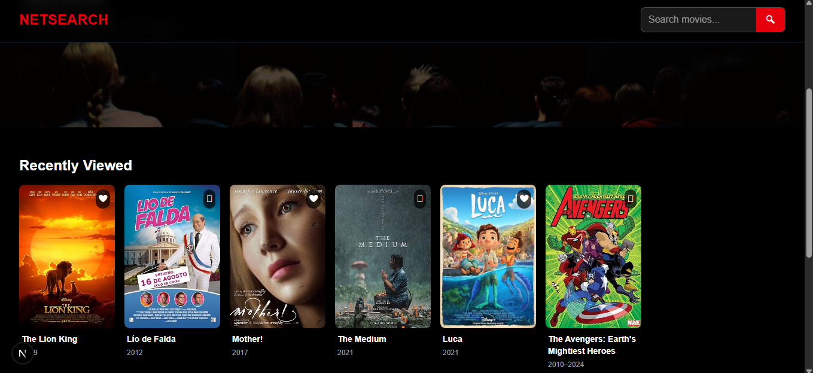
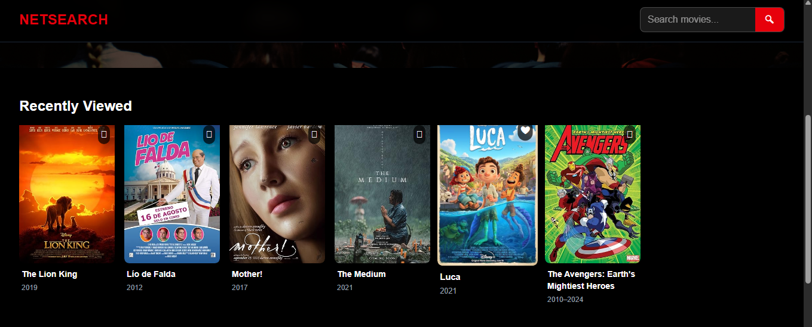

# Movie Discovery App

A modern **Netflix-style movie discovery web application** built using **Next.js**, **TypeScript**, and **Tailwind CSS**.  
This app allows users to search movies in real-time, explore detailed information, and manage personalized lists like **Watchlist** and **Recently Viewed** — all with a smooth and responsive UI.

---

## Features

### 🔍 Smart Live Search
- Real-time movie search as the user types  
- Debounced API calls to reduce unnecessary requests  
- Instant UI updates without page reloads  

---

### Movie Details Page
- Dynamic routing using Next.js (`/movie/[id]`)  
- Displays:
  - Title, Year, Genre  
  - IMDb Rating ⭐  
  - Plot summary  
- Clean hero-style layout for better UX  

---

### Watchlist (My List)
- Add/remove movies from watchlist  
- Stored using `localStorage` (no backend required)  
- Toggle UI (❤️ / 🤍) for real-time feedback  
- Dedicated **Watchlist page**  

---

### Recently Viewed
- Tracks movies clicked by the user  
- Displays recent movies on the homepage  
- Automatically removes duplicates  
- Limited to latest 10 items for performance  

---

### Smooth Horizontal Scrolling
- Netflix-style movie rows  
- Scroll using custom arrow buttons (← →)  
- Implemented using `useRef` and DOM manipulation  

---

### Modern UI/UX
- Fully responsive design (mobile + desktop)  
- Tailwind CSS styling  
- Hover animations on movie cards  
- Sticky navbar with blur effect  
- Clean spacing and layout consistency  

---

## Screenshots

### 🏠 Home Page


### 🔍 Search Results


### 🎬 Movie Details


### ❤️ Watchlist


### 🕓 Recently Viewed


---

## Key Concepts Implemented

- ⚛️ React Hooks (`useState`, `useEffect`, `useRef`)  
- 🔄 State-driven UI updates  
- ⚡ Debouncing for optimized API calls  
- 🌐 API integration using OMDB  
- 💾 LocalStorage for persistence (watchlist & history)  
- 🔗 Dynamic routing with Next.js  
- 🧩 Reusable component-based architecture  

---

## Tech Stack

| Technology     | Purpose                          |
|---------------|----------------------------------|
| Next.js       | Framework & routing              |
| React         | Component-based UI               |
| TypeScript    | Type safety                      |
| Tailwind CSS  | Styling & responsiveness         |
| OMDB API      | Movie data                       |

---

## Project Structure

```
app/
├── movie/
│   ├── [id]/page.tsx        # Movie details page
├── watchlist/
│   ├── page.tsx             # Watchlist page
├── components/
│   ├── MovieCard.tsx
├── page.tsx                 # Home page

public/
├── screenshots/             # Project screenshots

.env.local                   # API key (not committed)
```

---

## Getting Started

### 1. Clone the repository

```bash
git clone https://github.com/aishwarya-m-260803/movie-discovery-app.git
cd movie-discovery-app
```

---

### 2. Install dependencies

```bash
npm install
```

---

### 3. Add your OMDB API key

Create a `.env.local` file:

```env
NEXT_PUBLIC_OMDB_API_KEY=your_api_key_here
```

---

### 4. Run the app

```bash
npm run dev
```

---

### 5. Open in browser

```
http://localhost:3000
```

---

## Future Enhancements

- 🔐 User authentication (login/signup)  
- ☁️ Backend integration (database for watchlist)  
- 🤖 AI-based movie recommendations  
- 🎥 Trailer integration (YouTube API)  
- 🎯 Genre-based filtering  

---

## Author

**Aishwarya M**

---

 
